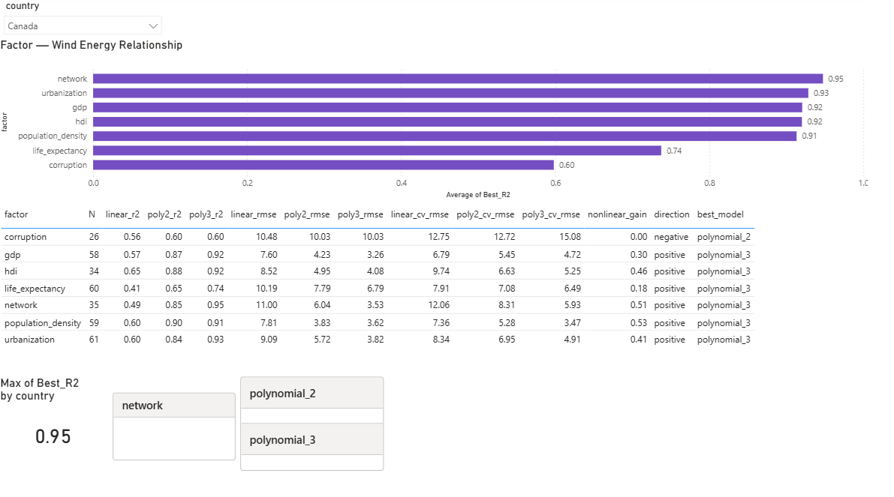

# Wind Energy Analysis

## About the Project

This project investigates the development of wind energy across countries and explores how it is associated with economic, demographic, social, and institutional indicators.

The main research question is:

> **Why does wind energy develop rapidly in some countries while remaining limited or almost absent in others?**

To investigate this question, wind electricity generation data is combined with a range of socioeconomic indicators.

The project follows a country-by-country analytical approach. For each country, relationships between wind electricity generation and selected indicators are analysed separately. The results are then used to build a **country profile** describing the type, direction, and strength of the observed relationships.

The final stage of the project will bring these country profiles together in order to identify common patterns, differences, and broader international trends.

The analysis is exploratory and focuses on statistical relationships rather than causal inference.

---

## Research Approach

The project follows a bottom-up analytical approach:

```text
Data Preparation
       ↓
SQL / DuckDB
       ↓
Preliminary Exploration
       ↓
Python EDA
       ↓
Country-Level Analysis
       ↓
Country Profiles
       ↓
Cross-Country Comparison
       ↓
Broader Trends & Conclusions
       ↓
Power BI Dashboard
````

The central idea is to avoid assuming that a relationship observed across all countries necessarily exists within every individual country.

Instead, the project first examines individual countries and then compares their profiles to identify broader patterns.

---

## Research Questions

The analysis focuses on relationships between wind electricity generation and several socioeconomic indicators.

The main questions include:

* Is wind electricity generation associated with economic development?
* How is wind energy development related to human development?
* Is there a relationship between wind energy development and population density?
* Is wind energy development associated with urbanization?
* Is there a relationship with life expectancy?
* Is wind energy development associated with internet usage?
* Is wind energy development related to the quality of governance?
* What type of relationship can be observed within individual countries?
* Do relationships differ substantially between countries?
* Which patterns appear repeatedly across countries?
* Which relationships appear to be country-specific?
* Can country profiles be grouped into broader patterns?

The project does not aim to identify a single universal factor explaining wind energy development.

Instead, the goal is to identify and compare different statistical patterns across countries.

---

# Data

The main wind energy data comes from **Our World in Data (OWID)**.

The primary target variable is:

* `wind_electricity` — electricity generation from wind, measured in TWh.

The dataset also contains:

* GDP
* population

Additional socioeconomic indicators were collected from other sources, including the World Bank and United Nations Development Programme.

### Main Variables

| Variable             | Description                            |
| -------------------- | -------------------------------------- |
| `country`            | Country name                           |
| `iso_code`           | Country identifier                     |
| `year`               | Year                                   |
| `wind_electricity`   | Electricity generation from wind       |
| `gdp`                | GDP                                    |
| `population`         | Population                             |
| `hdi`                | Human Development Index                |
| `population_density` | Population density                     |
| `urbanization`       | Urbanization rate                      |
| `life_expectancy`    | Life expectancy                        |
| `network`            | Share of population using the internet |
| `corruption`         | Control of Corruption indicator        |

---

# Data Preparation

The initial structure of the raw data was explored using Python.

DuckDB / SQL was then used for more detailed data inspection, cleaning, and integration of multiple data sources.

Particular attention was given to missing values in `wind_electricity`.

A missing value does not necessarily mean zero wind generation. It may instead indicate that the corresponding observation is unavailable.

Therefore, missing values were not automatically replaced with zero.

A practical heuristic was developed using the first observed positive wind generation value for each country and its share of global wind generation in the corresponding year.

A working threshold of **0.1% of global generation** was used to identify cases where preceding missing values could reasonably be interpreted as zero.

This threshold is a practical assumption rather than a universal statistical rule. Ambiguous cases were retained as missing rather than introducing potentially unjustified assumptions.

---

## Historical and Special Entities

During data preparation, several countries and historical entities required additional handling because of missing or inconsistent country identifiers.

These included:

* Kosovo
* Czechoslovakia
* East Germany
* West Germany
* USSR
* Yugoslavia
* Serbia and Montenegro

Additional identifiers were assigned where necessary so that these entities could be matched with other datasets.

---

# Data Integration

The different sources were converted into a common **country-year** structure.

`iso_code` was primarily used as the country identifier in order to match indicators across datasets without relying on differences in country naming conventions.

The integrated dataset is stored as:

```text
analysis_data
```

This dataset forms the basis for the subsequent exploratory and statistical analysis.

---

# Analytical Workflow

## 1. Python — Initial Exploration

Python was initially used to inspect:

* dataset structure;
* number of countries and years;
* missing values;
* variable distributions;
* basic characteristics of the data.

This stage was used to understand the dataset before more detailed processing.

---

## 2. SQL / DuckDB — Data Processing

DuckDB / SQL was used for:

* detailed data inspection;
* missing-value analysis;
* working with country-year observations;
* cleaning wind electricity data;
* integrating multiple data sources;
* preparing the datasets used in further analysis.

---

## 3. Excel — Preliminary Exploration

Excel was used for an early exploratory analysis of the integrated dataset.

This stage focused on:

* differences between countries;
* major trends;
* simple relationships between variables;
* potential non-linear relationships;
* identifying directions for further statistical analysis.

Excel is primarily used for preliminary exploration and hypothesis generation rather than as the main statistical analysis environment.

---

## 4. Python — Exploratory Data Analysis

Python is currently used for more detailed exploratory data analysis.

The analysis investigates relationships between wind electricity generation and selected socioeconomic indicators.

A major development of the project is the transition from analysing the dataset only as a whole to analysing **individual countries separately**.

For each country, the analysis examines:

* the strength of relationships;
* the direction of relationships;
* linear relationships;
* non-linear relationships;
* the performance of different models;
* the improvement obtained from non-linear models;
* the best-performing model for each indicator.

The current analysis compares linear, quadratic, and cubic polynomial models.

---

# Country Profiles

A central part of the project is the creation of a **country profile**.

A country profile summarizes the relationships observed between wind electricity generation and the selected indicators for a particular country.

For each factor, the analysis currently considers:

* number of observations (`N`);
* linear model R²;
* quadratic model R²;
* cubic model R²;
* RMSE;
* cross-validation RMSE;
* non-linear improvement;
* relationship direction;
* best-performing model.

The purpose of the country profile is to provide a structured description of how different indicators are related to wind energy development within a particular country.

For example, a profile may show that:

* GDP is better described by a cubic relationship than by a linear model;
* internet usage has a strong non-linear relationship;
* corruption has a weaker relationship;
* some indicators show only a limited improvement when moving from a linear to a non-linear model.

These results describe statistical relationships in the available data. They should not be interpreted as evidence that a particular factor directly causes changes in wind energy generation.

---

# Power BI Dashboard

Power BI is used as the interactive visualization layer of the project.

The dashboard allows the user to select a country and explore its individual wind energy relationship profile.



### Current Dashboard

The current dashboard contains:

* country selection;
* ranking of indicators by the best R² achieved;
* comparison of linear and polynomial models;
* model performance metrics;
* RMSE and cross-validation RMSE;
* non-linear improvement;
* relationship direction;
* identification of the best-performing model.

The main visualization ranks the analysed factors according to the best R² achieved among the tested models.

The detailed table allows the different model specifications to be compared for each factor.

For example, for Canada, the current analysis shows:

| Factor             | Best R² | Best Model   |
| ------------------ | ------: | ------------ |
| Network            |    0.95 | Polynomial 3 |
| Urbanization       |    0.93 | Polynomial 3 |
| GDP                |    0.92 | Polynomial 3 |
| HDI                |    0.92 | Polynomial 3 |
| Population density |    0.91 | Polynomial 3 |
| Life expectancy    |    0.74 | Polynomial 3 |
| Corruption         |    0.60 | Polynomial 2 |

The dashboard is intended to make these country-level results easier to explore and interpret.

The exact classification of relationships and the dashboard structure may change as the analytical methodology develops.

---

# Cross-Country Comparison

The country profiles are not the final goal of the project.

After individual country profiles have been developed, they will be compared with one another.

The purpose of this stage is to move from:

> **What happens in this country?**

to:

> **What patterns appear across countries?**

The comparison will investigate:

* relationships that appear consistently across many countries;
* relationships that are specific to particular countries;
* countries with similar profiles;
* countries with substantially different profiles;
* possible regional patterns;
* possible development-level patterns;
* indicators that show similar relationships across different countries;
* relationships that change substantially between countries.

The final conclusions will be based on the comparison of these country-level results.

---

# Preliminary Findings

An early exploratory analysis suggested that the relationship between wind electricity generation and several socioeconomic indicators may be substantially non-linear when countries are considered together.

For example, preliminary polynomial fits produced relatively high R² values for several indicators:

| Indicator          | Preliminary Polynomial R² |
| ------------------ | ------------------------: |
| GDP                |                     0.947 |
| Life expectancy    |                     0.914 |
| HDI                |                     0.940 |
| Population density |                     0.909 |
| Urbanization       |                    ~0.229 |

These results were obtained during the preliminary exploratory stage.

They should not be interpreted as causal relationships.

More importantly, these global relationships do not necessarily imply that the same relationship exists within every individual country.

This observation motivated the transition toward country-level analysis.

---

# Limitations

## Statistical Association Is Not Causation

A statistical relationship does not demonstrate that one variable causes changes in wind energy development.

A high R² only indicates that a particular model describes a substantial part of the observed variation in the data.

## Country-Level Relationships May Differ

A relationship visible in the full international dataset may be caused by differences between countries rather than by changes occurring within individual countries.

This is why country-level analysis is an important part of the project.

## Missing Geographical and Physical Factors

The current analysis does not include many factors directly related to the physical potential for wind energy, such as:

* wind resource availability;
* terrain;
* climate;
* geographical characteristics;
* land availability.

Therefore, the project does not attempt to provide a complete explanation of why wind energy develops differently between countries.

## Data Availability

The integrated dataset combines several sources.

The availability and comparability of individual indicators may therefore vary across countries and years.

## Scale Effects

Absolute wind electricity generation is naturally influenced by the size of a country's population and economy.

Future stages may therefore consider normalized indicators such as:

* wind generation per capita;
* wind generation as a share of total electricity generation;
* wind generation relative to GDP;
* wind capacity relative to population.

---

# Project Status

The project is actively being developed.

## Completed

* [x] Explored the structure of the raw dataset
* [x] Investigated missing wind electricity values
* [x] Developed a practical approach for handling ambiguous missing values
* [x] Handled historical and special entities with missing identifiers
* [x] Prepared the wind energy dataset
* [x] Collected additional socioeconomic indicators
* [x] Integrated multiple datasets into `analysis_data`
* [x] Conducted preliminary exploratory analysis in Excel
* [x] Identified preliminary non-linear patterns
* [x] Expanded the Python notebook with exploratory data analysis
* [x] Started country-level analysis
* [x] Developed the first version of country profiles
* [x] Started the Power BI dashboard
* [x] Added DAX calculations to the dashboard

## In Progress

* [ ] Refine country-level relationship analysis
* [ ] Define a consistent methodology for classifying relationship types
* [ ] Complete country profiles
* [ ] Improve model validation
* [ ] Compare country profiles
* [ ] Identify recurring international patterns
* [ ] Investigate country-specific differences
* [ ] Improve the Power BI dashboard
* [ ] Add cross-country analytical views
* [ ] Formulate broader conclusions

## Planned

* [ ] Compare additional model specifications where appropriate
* [ ] Perform residual analysis
* [ ] Evaluate model adequacy
* [ ] Investigate time effects and potential lags
* [ ] Consider multivariable models
* [ ] Explore normalized wind-energy indicators
* [ ] Investigate clustering or other approaches for comparing country profiles
* [ ] Evaluate machine-learning approaches where they provide additional value
* [ ] Interpret the final results
* [ ] Summarize the main findings across countries

---

# Project Progress

This section is maintained as a chronological development log.

New milestones can be added here without rewriting the rest of the README.

### 2026-10-07 — Country-Level EDA and Power BI Profile

Expanded the Python analysis toward country-level exploratory analysis.

The current workflow analyses relationships between wind electricity generation and socioeconomic indicators separately for each country.

Started developing a structured country profile containing:

* model performance;
* relationship direction;
* non-linear improvement;
* best-performing model;
* comparison between linear and polynomial specifications.

The first version of the Power BI dashboard was also developed to provide an interactive view of these country profiles.

The next step is to complete the country-level profiles and compare them in order to identify recurring and country-specific patterns.

---

### Previous Progress

#### Data Preparation

* Integrated wind energy data with socioeconomic indicators.
* Investigated missing values and developed a practical approach for ambiguous observations.
* Standardized datasets using a country-year structure.
* Used country identifiers to integrate data from different sources.

#### Preliminary Exploration

* Used Excel to explore relationships between wind electricity generation and socioeconomic variables.
* Identified indications of non-linear relationships.
* Used these observations to define directions for further analysis.

#### Python Analysis

* Expanded the analysis from preliminary exploration to detailed EDA.
* Began analysing individual countries separately.
* Started comparing linear and polynomial relationships.
* Began developing country-level analytical profiles.

#### Power BI

* Created the first version of the interactive country profile dashboard.
* Added country selection.
* Added factor ranking by best R².
* Added model comparison metrics.
* Added DAX-derived calculations.

---

# Repository Structure

```text
wind_energy_analysis/
│
├── data_for_analysis/
│   └── Data used for analysis
│
├── excel_result/
│   └── Preliminary Excel analysis
│
├── results/
│   └── Analysis results and generated outputs
│
├── images/
│   └── power_bi_country_profile.png
│
├── Wind_electricity_analysis.ipynb
│   └── Python data analysis and EDA
│
├── dashboard.pbix
│   └── Power BI dashboard
│
└── README.md
    └── Project documentation
```

The repository structure may change as the project develops.

---

# Tools

The project currently uses:

* **SQL / DuckDB** — data inspection, cleaning, and integration
* **Python** — exploratory data analysis and statistical analysis
* **Pandas** — data manipulation
* **Matplotlib / Seaborn** — visualization
* **Excel** — preliminary exploration and hypothesis generation
* **Power BI** — interactive dashboard development
* **DAX** — calculated columns and measures

---

# Interpretation

The project follows a layered analytical approach:

```text
Global Dataset
      ↓
Individual Countries
      ↓
Country Profiles
      ↓
Cross-Country Comparison
      ↓
Common & Country-Specific Patterns
      ↓
Broader Conclusions
```

The country profile is therefore not the final result.

It is an intermediate analytical layer that allows the project to move from individual country observations toward broader conclusions about wind energy development.

The final interpretation will be developed after a sufficient number of country profiles have been analysed and compared.

---

# Project Goal

The long-term goal is to build a reproducible analytical workflow for investigating how wind energy development is associated with socioeconomic conditions across countries.

The final project should combine:

**Data Preparation → Exploratory Analysis → Country Profiles → Cross-Country Comparison → Statistical Interpretation → Interactive Visualization**

The expected final outcome is a structured analysis of both:

* **common patterns** that appear across multiple countries;
* **country-specific patterns** that distinguish individual countries.

The project is intended as an exploratory analytical study rather than a causal model of wind energy development.

```
```

[1]: https://github.com/smell0of0chamomile/wind_energy_analysis "GitHub - smell0of0chamomile/wind_energy_analysis · GitHub"
